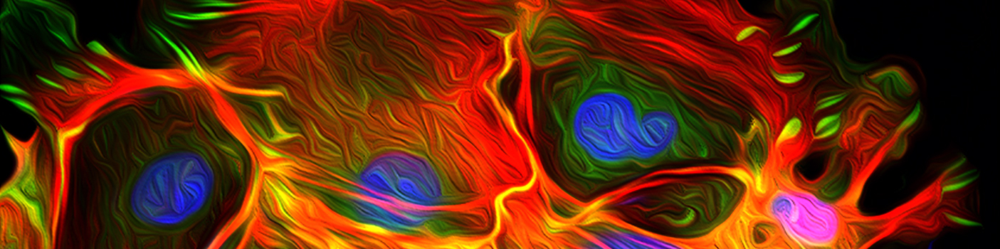
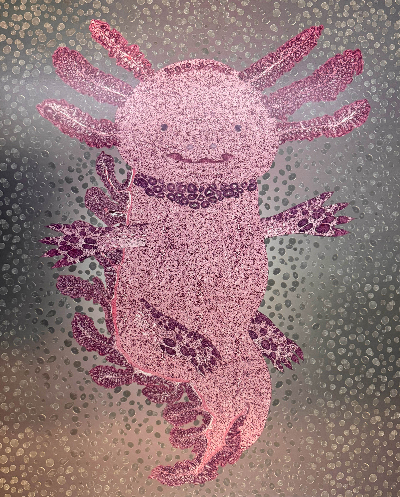

# Welcome to the Parkos-Nusrat Group

Our laboratories have closely collaborated for over two decades. Our group investigates mechanisms regulating the intestinal barrier during health and disease, with the particular focus on pathologic inflammatory states. We are interested in understanding the fundamental mechanisms controlling epithelial homeostasis, which includes maintenance of barrier function through cellular migration, proliferation and repair, and how these processes are impacted in disease.

## **Meet the Lab**

PI

  
  [Charles Parkos, MD, PhD](https://www.pathology.med.umich.edu/faculty/cparkos)
  
  [Asma Nusrat, MD](https://www.pathology.med.umich.edu/faculty/anusrat)
  

Faculty

  
  [Miguel Quiros, PhD](https://www.pathology.med.umich.edu/faculty/mquirosq)
  
  [Jennifer Brazil, PhD](https://www.pathology.med.umich.edu/faculty/brazilj)
  
  [Vicky Garcia-Hernandez, PhD](https://www.pathology.med.umich.edu/directory/vgarciah)
  
  [Shuling Fan, PhD](https://www.pathology.med.umich.edu/directory/shulingf)
  
  [Arturo Raya-Sandino, PhD](https://www.pathology.med.umich.edu/faculty/jrayasan)
  

Post-Docs

  
  [Jael Miranda-Guzman, PhD](https://www.pathology.med.umich.edu/directory/jaelmi)
  
  [Armando Montoya-Garcia, PhD](https://www.pathology.med.umich.edu/directory/marmando)
  
  [Sandhya Padmanabhan, PhD](https://www.pathology.med.umich.edu/directory/pasandhy)
  
  [Saranyaraajan Varadarajan, PhD](https://www.pathology.med.umich.edu/directory/varadars)
  
  [Zach Wilson, PhD](https://www.pathology.med.umich.edu/faculty/wilsonza)

  [Natasha Golovchenko, PhD](https://www.pathology.med.umich.edu/directory/nbgol)
  

Students

  
  [Rodolfo Ismael Cabrera-Silva, MSc](https://www.pathology.med.umich.edu/directory/ricsilva)
  

Tech

  
  [Dylan Fink, BS](https://www.pathology.med.umich.edu/directory/dyfink)
  
  [Yelitzza Aguilar, BS](https://www.pathology.med.umich.edu/directory/aguilary)
  

